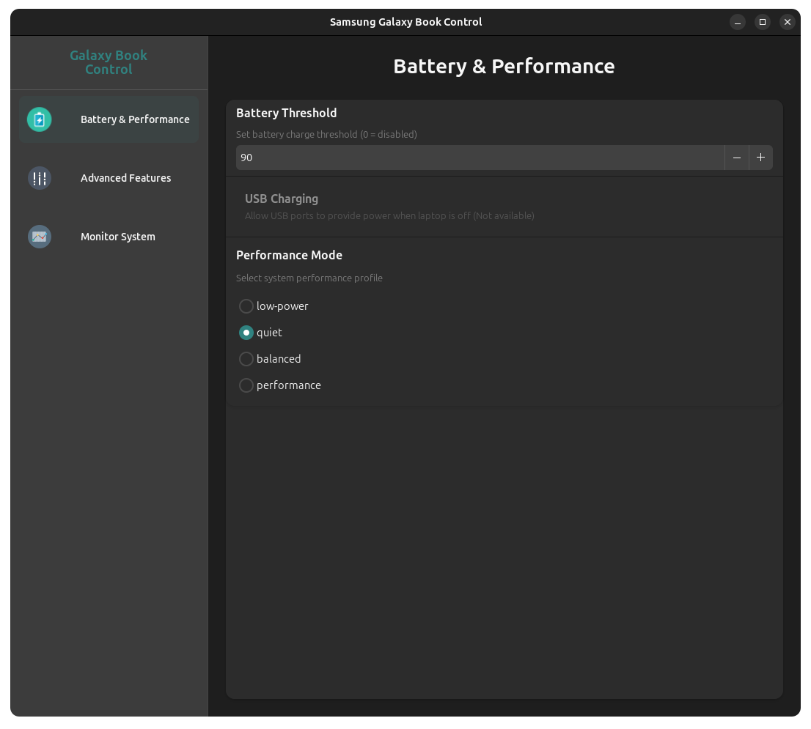
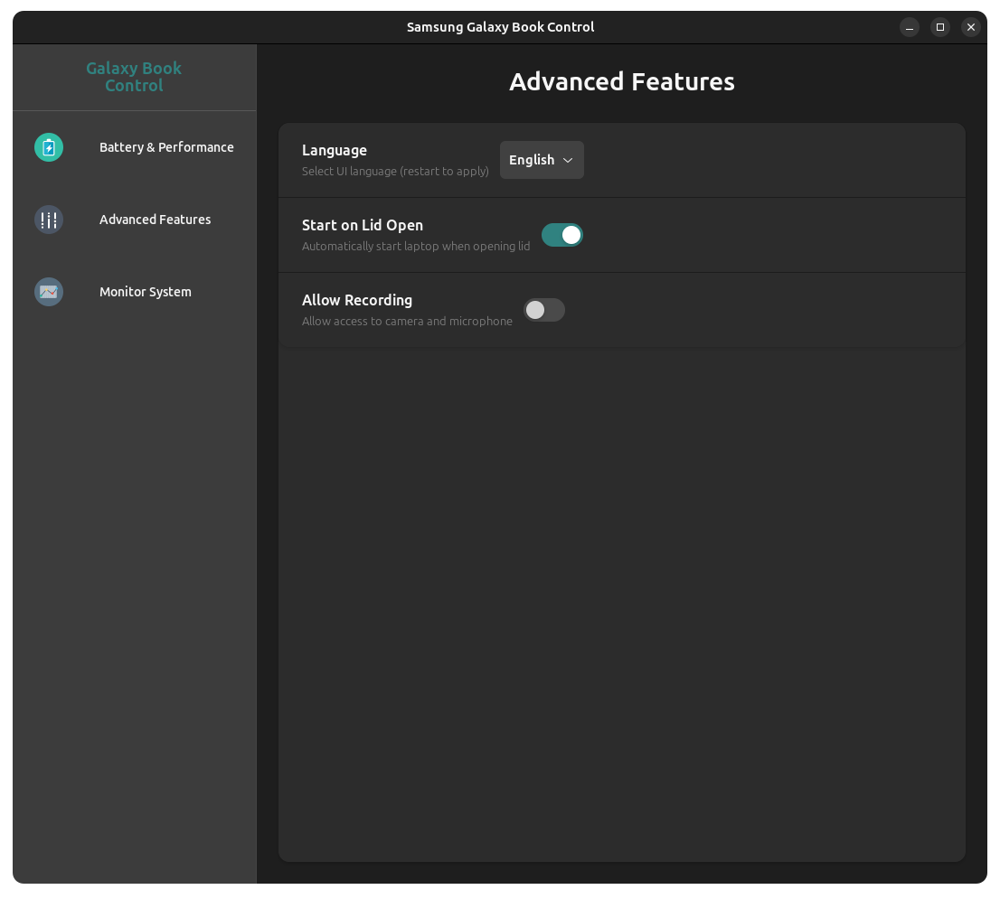
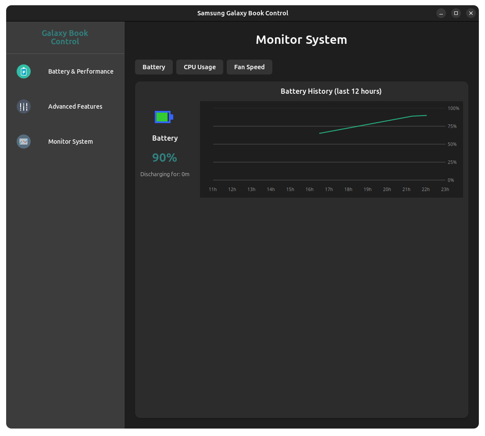

# Samsung Galaxy Book Control for Linux

> ⚠️ **Fork notice:** this repository is a fork of
> [EvickaStudio/samsung-control-linux](https://github.com/EvickaStudio/samsung-control-linux).
>
> [!IMPORTANT]
> This application is currently in development and has been tested on **Ubuntu 24.04.4** running a
> **Samsung Galaxy Book 4 i3**.  The software requires **Linux kernel 6.15 or newer**; earlier kernels do
> not ship the Samsung platform driver and may need the third‑party
> `samsung-galaxybook-extras` module (see below).
>
A system settings application for Samsung Galaxy Book laptops running Linux,
providing similar functionality to Samsung Settings on Windows. The
application offers a modern GTK4 interface to control various laptop
features and hardware settings.

## Kernel support and dependencies

The UI communicates with the Samsung platform driver exposed by the kernel at
`/dev/samsung-galaxybook`.  That driver is included in **mainline Linux as of
6.15**; if you are running an older kernel you will need the
[`samsung-galaxybook-extras`](https://github.com/joshuagrisham/samsung-galaxybook-extras)
module.  The extra module is considered a stop‑gap and is unnecessary on
kernels ≥ 6.15.

When present, the kernel driver provides the following features:

- ACPI interaction with Samsung's SCAI device
- Keyboard backlight control
- Battery threshold and USB charge switching
- Performance profile management
- Camera/microphone block/allow

Use the features at your own discretion.  On modern kernels the driver is
built‑in and maintained upstream; on older kernels you are relying on the
third‑party extras release.

## Features

Below are a few screenshots demonstrating the interface.  The images are
located in `assets/screenshots/` and are shipped with the repository so they
work offline.





- Modern GTK4/libadwaita UI
- Real-time system monitoring
  - Fan speed with RPM history graph
  - CPU usage tracking (kernel‑independent)
  - Battery status and charge/discharge info (kernel‑independent)
- Hardware controls
  - Keyboard backlight brightness
  - Battery charge threshold
  - Lid‑open power on/off
  - Camera/mic access block/allow
  - Performance mode selection

## Performance Profiles Analysis (Geekbench 6)

| Mode | Single-Core | Multi-Core | Notes |
|------|-------------|------------|--------|
| [Performance](https://browser.geekbench.com/v6/cpu/9702316) | 2372 | 10407 | Maximum performance |
| [Balanced](https://browser.geekbench.com/v6/cpu/9702378) | 2403 | 10404 | No performance loss when plugged in |
| [Quiet](https://browser.geekbench.com/v6/cpu/9702538) | 1215 | 4588 | Silent operation, ~50% performance |
| [Low-power](https://browser.geekbench.com/v6/cpu/9702639) | 1204 | 4607 | Power-efficient, similar to quiet mode |

[Performance/ Balanced vs. Quiet/ Low-power](https://browser.geekbench.com/v6/cpu/compare/9702538?baseline=9702316)

> Performance Analysis:
>
> - Balanced mode achieves similar performance to Performance mode
> - Quiet and Low-power modes trade ~50% performance for better thermals/battery
> - Perfect for switching between max performance and silent operation

## System Requirements

- **Kernel 6.15 or newer** (required for built‑in Samsung driver)
- Python 3.x with GTK 4 and libadwaita
- Optional: `samsung-galaxybook-extras` module if running an older kernel

## Installation

### 1. Clone the Repository

```bash
# Clone with submodules
git clone https://github.com/EvickaStudio/samsung-control-linux.git
cd samsung-control-linux

# If you already cloned without --recursive, run:
git submodule update --init
```

### 2. Install Components

Before installing the GUI, make sure the `samsung-galaxybook` kernel driver is
available.  On kernels newer than 6.15 it is included; otherwise build/install
it from the `samsung-galaxybook-extras` repository.

To install the application itself:

```bash
sudo ./install.sh
```

After installation, you will find “Samsung Galaxy Book Control” in your
applications menu.

### Uninstalling

To remove the application and all its components:

```bash
sudo ./install.sh uninstall
```

For more options, including help:

```bash
sudo ./install.sh --help
```

## Additional Resources

For more information about Samsung Galaxy Book Linux compatibility:

- [samsung-galaxybook-extras](https://github.com/joshuagrisham/samsung-galaxybook-extras) –
  third‑party driver for kernels < 6.15
- [galaxy-book2-pro-linux](https://github.com/joshuagrisham/galaxy-book2-pro-linux) –
  audio support

> 💡 This code and the README text were produced with the help of AI prompts.

## License

[MIT License](LICENSE)
